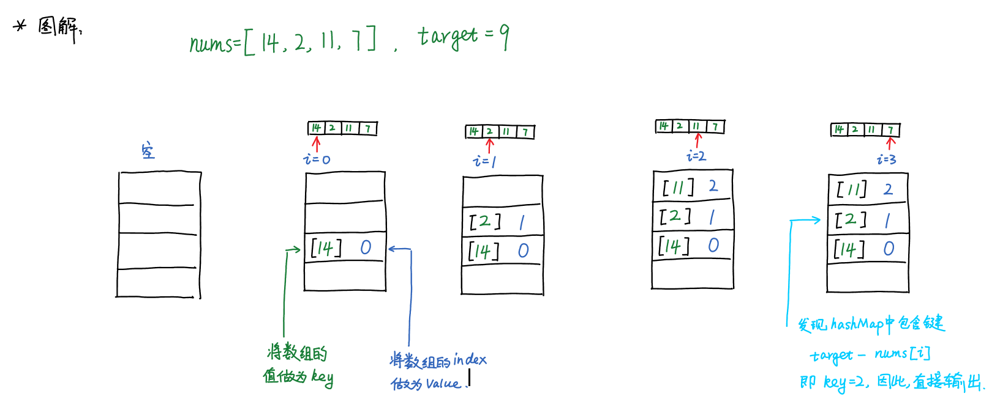

# 1. Two Sum

Given an array of integers, return indices of the two numbers such that they add up to a specific target.

You may assume that each input would have exactly one solution, and you may not use the same element twice.

## Example:

```
Given nums = [2, 7, 11, 15], target = 9,

Because nums[0] + nums[1] = 2 + 7 = 9,

return [0, 1].
```

## 思路

最开始的想法是双重循环，然而题目的计算复杂度要求是O($n$),因此不满足。

应该采用hashMap数据结构，边存储边查询。

关键是将数组中的**值**作为hashMap中的key

## 代码

```java
class Solution {
    public int[] twoSum(int[] nums, int target) {
        int len = nums.length;  //数组长度
        
        HashMap<Integer, Integer> map = new HashMap<>();//新建一个hashMap
        
        for (int i = 0; i < len; ++i) {  //开始遍历
            //判断是否包含与nums[i]相加等于target的key
            if (map.containsKey(target - nums[i]))                 
            {                
                return new int[]{map.get(target - nums[i]), i};//如果有，就返回结果
            }
            map.put(nums[i], i); //如果没有就放入hashMap
        }
        return null;
    }
}
```

## 图解



## 知识点

* 数组的长度`arr.length`
* 新建hashMap的语句 ： `new hashMap<Integer,Integer>()`
* 判断是否存在键`map.containsKey()`
* 输入entry为： `map.put(key,value)`
* 得到entry为： `map.get(key)`

