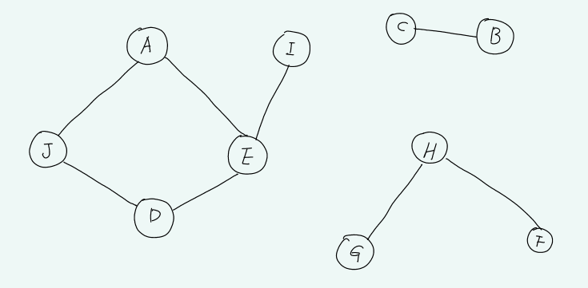
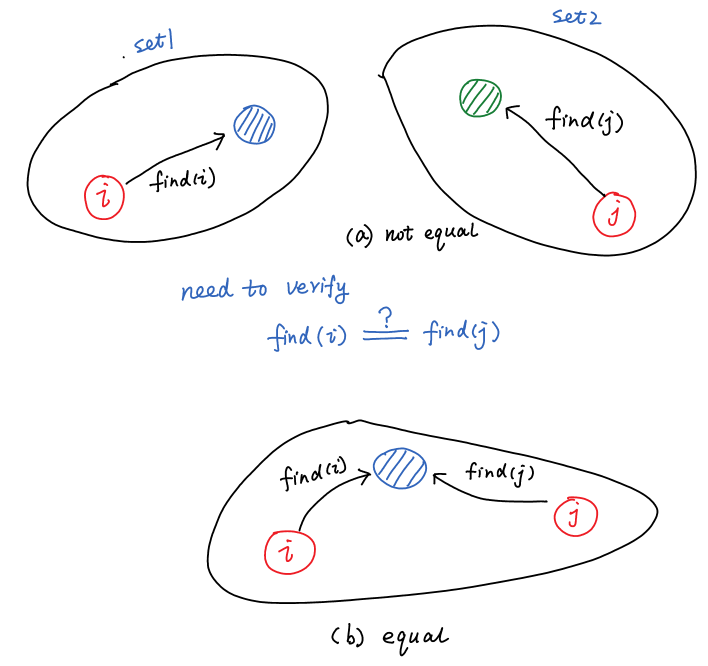
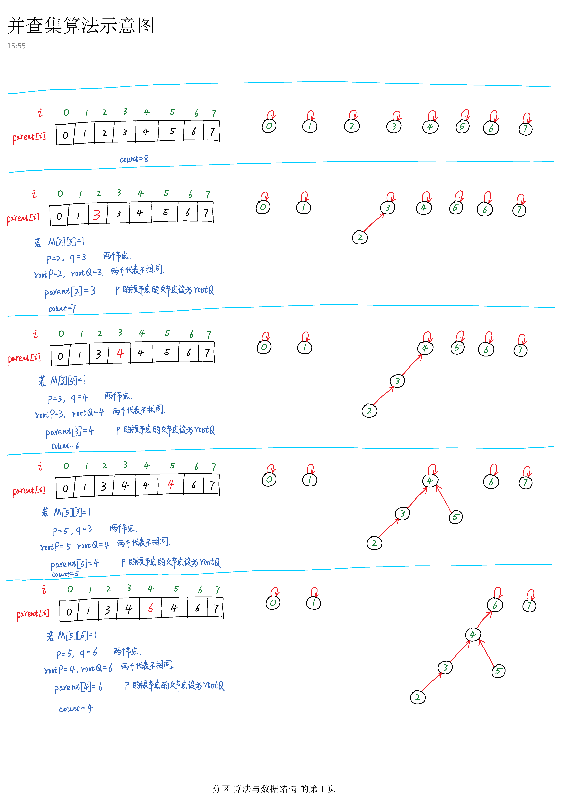
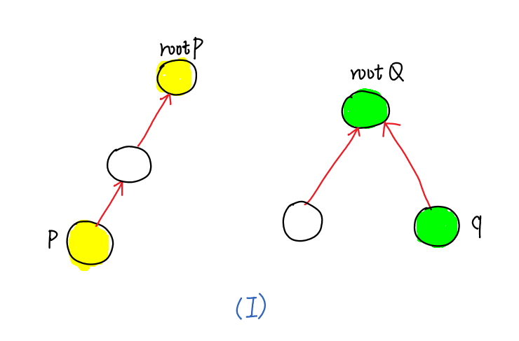
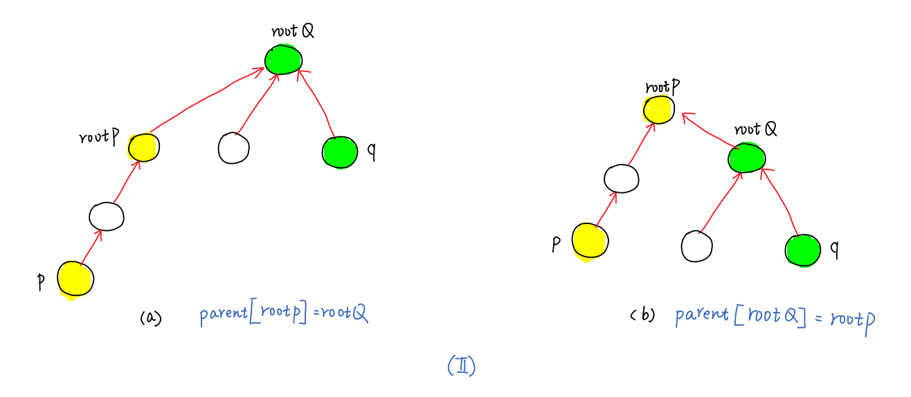
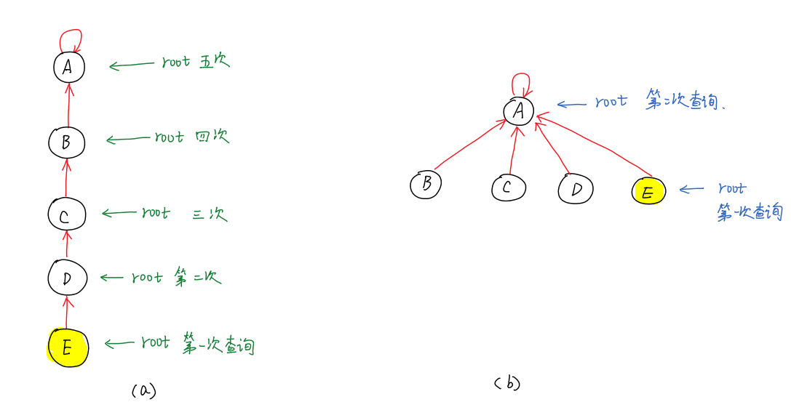
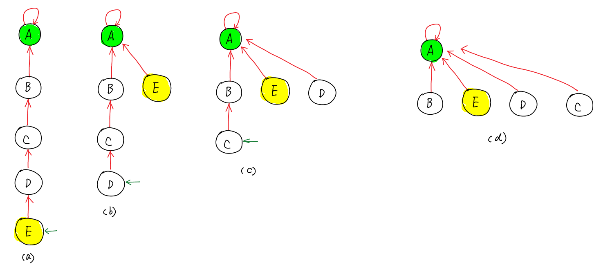
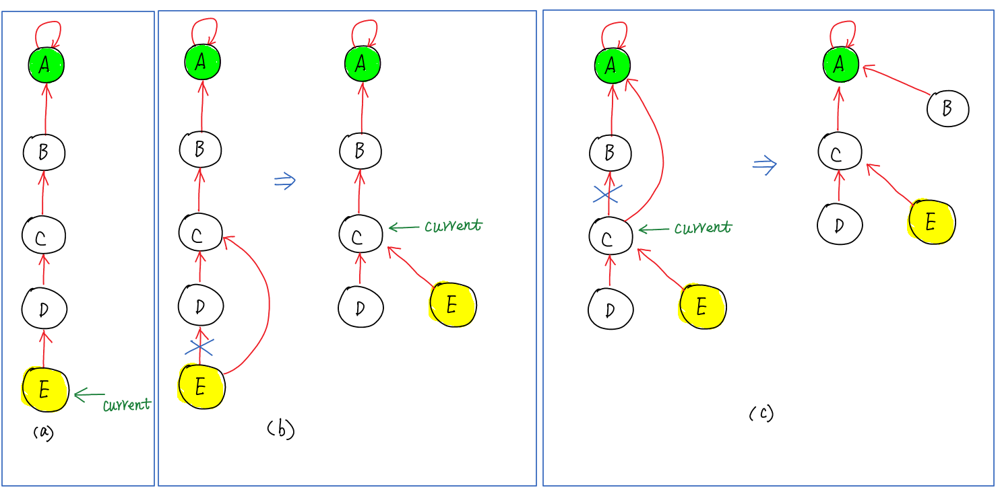

# 547. Friend Circles

## [问题](https://leetcode.com/problems/friend-circles/)

There are **N** students in a class. Some of them are friends, while some are not. Their friendship is transitive in nature. For example, if A is a **direct** friend of B, and B is a **direct** friend of C, then A is an **indirect** friend of C. And we defined a friend circle is a group of students who are direct or indirect friends.

Given a **N\*N** matrix **M** representing the friend relationship between students in the class. If M[i][j] = 1, then the ith and jthstudents are **direct** friends with each other, otherwise not. And you have to output the total number of friend circles among all the students.

**Example 1:**

```
Input: 
[[1,1,0],
 [1,1,0],
 [0,0,1]]
Output: 2
Explanation:The 0th and 1st students are direct friends, so they are in a friend circle. 
The 2nd student himself is in a friend circle. So return 2.
```


**Example 2:**

```
Input: 
[[1,1,0],
 [1,1,1],
 [0,1,1]]
Output: 1
Explanation:The 0th and 1st students are direct friends, the 1st and 2nd students are direct friends, 
so the 0th and 2nd students are indirect friends. All of them are in the same friend circle, so return 1.
```


**Note:**

1. $N$ is in range [1,200].
2. $M[i][i]$= 1 for all students.
3. If $M[i][j]$ = 1, then $M[j][i]$ = 1.


## 题目分析

给定一个方阵$M$，由于定于n个节点之间的联系： $M[i][j]$ = 1表示节点$i$和节点$j$之间是朋友关系，并且朋友关系是可传递，定义**朋友环（ friend circle）**为具有*直接*或*非直接*朋友关系所组成的节点。



> 给定$M$,要求统计出，朋友环的数目。

上图中，朋友环的数目为3.

## 思路

采用**并查集**数，统计其中**子集**的数目。

并查集是一种数据结构，用于处理一些不相交集合(Disjoint Sets）的合并及查询问题。常常在使用中以森林来表示。

我们通常是在开始时让每个元素构成一个单元素的集合，然后按一定顺序将属于同一组的元素所在的集合合并，其间要反复查找一个元素在哪个集合中。

在上述过程中涉及：

> 1. 给定两个节点$i$和$j$,我们需要知道他们是否在同一个集合内
> 2. 若节点$i$和$j$不属于同一集合，我们需要合并它们

最后我们统计互不相交的集合的个数就可以了。


对于任意一个集合，我们都定义一个节点作为集合的“**代表**”，集合内的其他节点通过**find()**函数，能够找到此代表。若节点$i$所处集合的代表find(i) 与节点$j$所处集合的代表find(j)相同，即$$\text{find}(i)==\text{find}(j)$$则表示他们处于同一集合。

若发现$$\text{find}(i) \ne\text{find}(j)$$,此时就需要合并这两个集合，上述两种情况如下图所示。




我们采用**树**结构，每一颗树就是一个集合，将树的**根节点**作为集合的代表：

1. 判断两个节点是否处于同一集合，就是判断他们的根节点是否相同
2. 集合的合并就是**树的合并**。

我们在数组的基础上，实现并查集，为此：

1. 采用parent[i]记录节点i上层节点
2. 实现find()函数找到树的根节点
3. 实现merge()函数实现树的合并

## 算法实现(原始)

```java
/**
 * 实现并查集
 */
public class UnionSet {

    private  int[]  parent; //记录上一级节点
    private int count;

    /**
     * 为节点i找到根节点
     * @param i
     * @return
     */
    public  int find(int i){

        int root=i;//初始化为当前节点

        while( parent[root] !=root)  //不断查询上一级节点
            root=parent[root];

        return  root;

    }

    /**
     * 合并两个节点所处的树
     * @param p
     * @param q
     */
    public void merge(int p,int q){
        int  rootP=find(p);
        int  rootQ=find(q);//找到各自的根节点

        if(rootP==rootQ)
            return;

        parent[rootP]=q; //注意，这里是rootP，也就是P所处的树的根节点

        count--; //合并之后要减去1


    }


    /**
     * 计算朋友圈
     * @param M
     * @return
     */
    public int findCircleNum(int[][] M) {

        count= M.length; //初始时，每个节点就是一个集合

        parent=new int[count];//
        for(int i=0;i<count;i++){
            parent[i]=i;
            //初始时，每个节点都是一个独立的集合，
            // 其集合代表就是自身
        }


        for(int i=0;i < M.length;i++)
            for(int j=i+1;j<M.length;j++){
                if(M[i][j]==1)  //只有为1的时候才进行判断是否合并
                    merge(i,j);
            }

        return count;
    }


    public static  void main(String[] args){


        int[][]  M={{1,1,1},{1,1,1},{1,1,1}}; //测试

        UnionSet ust =new UnionSet(); //初始化
        int num= ust.findCircleNum(M);

        System.out.println(num);


    }
}

```


 ### parent数组

我们通过数组parent来定义节点的上一层节点，初始化时，每个节点都被看做独立的集合，集合的代表就是其本身。

parent[i] 代表节点i的父节点，注意：i代表节点，也是索引index，在数组parent的第i个位置的值，是它的父节点的index

### 算法示意图



上述程序的运行结果在leetcode上击败了74%的提交。

在集合合并的时候，我们需要更合适的合并操作，以提高算法的运行效率。

## 算法实现（改进）

### 集合合并

对于如下两个树的合并：



存在如下两种合并方式：



我们发现合并后，树（a）比树（b）的深度要深。事实上，我们更倾向于合并之后的树的深度较小，这样有利于快速查询根节点。

我们发现将**深度小的子树的根节点的上一层**设为**深度大的子树的根节点**，有利于生成深度较小的树。

为了记录子树的深度信息，我们引入**rank**数组，初始化时，全部设置为1,改进后的合并函数如下。

```java
    public void merge(int p,int q){
        
        int  rootP=find(p);
        int  rootQ=find(q);//找到各自的根节点

        if(rootP==rootQ)
            return;

        if(rank[rootP] > rank[rootQ])
            parent[rootQ]=rootP;
        else 
        {
           parent[rootP] = rootQ; //注意，这里是rootP，也就是P所处的树的根节点
            
           if (rank[rootP] == rank[rootQ])
               rank[rootQ]++;   //两个深度相等的子树，被作为父节点的rank加1

        }
        count--; //合并之后要减去1
    }
```

### 路径压缩

如果一个数的深度很深，则查询根节点就会比较耗时，例如下面这种情况:



对于树（a），如果要查找E的根节点，则需要5次，而对于树（b），我们只需要2次，查询速度明显提高。

实际上方便于以后根节点的查询，我们可以将（a）通过**路径压缩**的方法转化为（b），主要的内容就是将查询路径中的节点的上一层直接设置为根节点。

存在两种路径压缩的方式：

1. 第一种是在找到根节点后，设置查询路径上的根节点的父节点为根节点；
2. 另一种是，在查询根节点的过程中，动态地设置**部分**节点的父节点为根节点。

第一种：



此种情况下，我们已经找到了E的根节点，因此，只要将从E到A的路径上，所有的点的父节点设置为A就可以了。

对应的代码为：

```java
    public  int find(int i){

        int root=i;//初始化为当前节点
        while( parent[root] !=root)
        { //不断查询上一级节点
             root=find(parent[root]);
        }

        return  root;

    }
```

该方法采用递归方式为路径上的点不断设置父节点为root，实际运行效率不高。

第二种：



```java
  public  int find(int i){

        int root=i;//初始化为当前节点

        while( parent[root] !=root)
        {  //不断查询上一级节点
            root=parent[parent[root]]; //路径压缩,跨一个节点       
            root=parent[root];
        }
        return  root;
    }
```

可以看到，采用这种方式设置父节点为根节点，root（即图中的root）每次跨过一个节点。这样生成的是二叉树。

在下面的算法实现（改进）中，我们采用此种方法。


## 算法实现（改进）

```java
/**
 * 实现并查集(改进)
 */
public class UnionSet2 {

    private  int[]  parent; //记录上一级节点
    private int count;
    private int[] rank;

    /**
     * 为节点i找到根节点
     * @param i
     * @return
     */
    public  int find(int i){

        int root=i;//初始化为当前节点

        while( parent[root] !=root)
        { //不断查询上一级节点
            root=parent[parent[root]]; //路径压缩
            root=parent[root];
        }
        return  root;

    }

    /**
     * 合并两个节点所处的树
     * @param p
     * @param q
     */
    public void merge(int p,int q){
        int  rootP=find(p);
        int  rootQ=find(q);//找到各自的根节点

        if(rootP==rootQ)
            return;

        if(rank[rootP] > rank[rootQ])
            parent[rootQ]=rootP;
        else {
            parent[rootP] = rootQ; //注意，这里是rootP，也就是P所处的树的根节点
            if (rank[rootP] == rank[rootQ])
                 rank[rootQ]++;  //相等的情况下，深度肯定会增加
             }
             
        count--; //合并之后要减去1

    }

    /**
     * 计算朋友换
     * @param M
     * @return
     */
    public int findCircleNum(int[][] M) {

       init(M);

        for(int i=0;i < M.length;i++)
            for(int j=i+1;j<M.length;j++){
                if(M[i][j]==1)  //只有为1的时候才进行判断是否合并
                    merge(i,j);
            }

        return count;
    }

    public  void  init(int[][] M){
        count= M.length; //初始时，每个节点就是一个集合

        parent=new int[count];//
        rank =new int[count];
        for(int i=0;i<count;i++){
            parent[i]=i;
            rank[i]=1;

            //初始时，每个节点都是一个独立的集合，
            // 其集合代表就是自身
        }
    }


    public static  void main(String[] args){

        int[][]  M={{1,0,0},{0,1,0},{0,0,1}};//矩阵

        UnionSet2 ust =new UnionSet2(); //初始化
        int num= ust.findCircleNum(M);

        System.out.println(num);

    }

}

```

改进后的算法在Leetcode上战胜了97%的提交记录。

# 总结

并查集是一种高效地组织非相交集合的数据结构。在使用时要注意**子树的合并**和**路径压缩**。