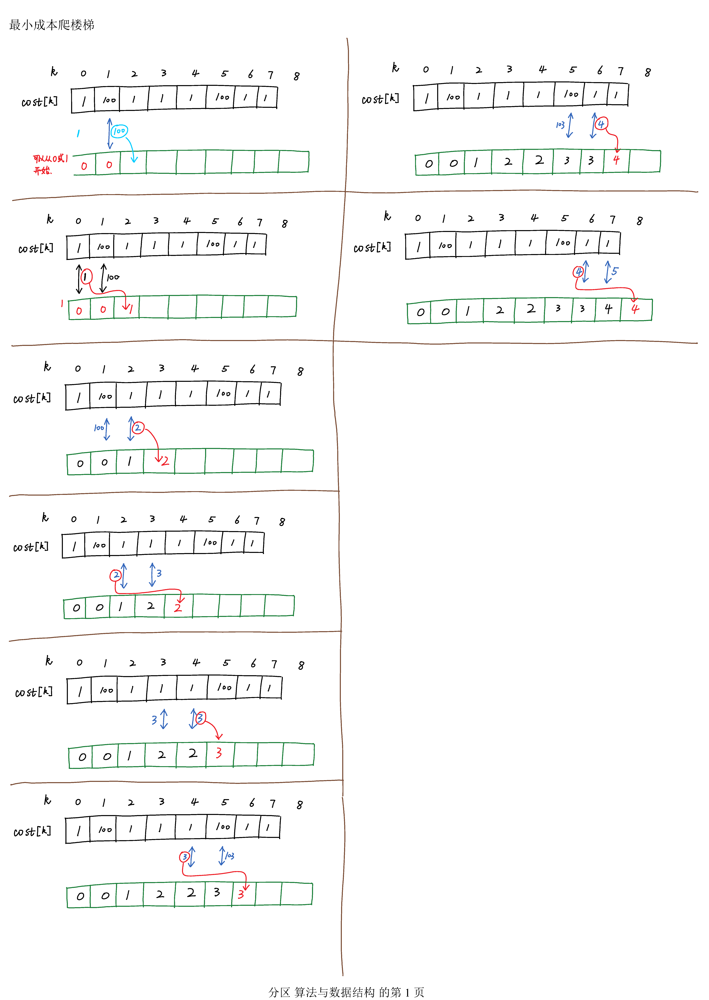

#  746. Min Cost Climbing Stairs

## 问题

On a staircase, the `i`-th step has some non-negative cost `cost[i]` assigned (0 indexed).

Once you pay the cost, you can either climb one or two steps. You need to find minimum cost to reach the top of the floor, and you can either start from the step with index 0, or the step with index 1.

**Example 1:**

```
Input: cost = [10, 15, 20]
Output: 15
Explanation: Cheapest is start on cost[1], pay that cost and go to the top.
```


**Example 2:**

```
Input: cost = [1, 100, 1, 1, 1, 100, 1, 1, 100, 1]
Output: 6
Explanation: Cheapest is start on cost[0], and only step on 1s, skipping cost[3].
```


**Note:**

1. `cost` will have a length in the range `[2, 1000]`.
2. Every `cost[i]` will be an integer in the range `[0, 999]`.

## 思路

题目要求：寻找一个“爬楼”的序列，使得到楼顶的成本cost最低。


仔细分析题意，数值中**cost[i]**代表成本，其意义是

> 花费成本cost[i]可以爬一个台阶，或两个台阶，即爬到第$i+1$或$i+2$层

还要注意，题目说可以从搜索*0*或1开始爬，这里的意思是：**假设存在-1层，则cost[-1]的值为0，因为从第-1层可以爬一个台阶到0层，也可以爬2层到第1层，所需成本均为0**


采用**动态规划**法，定义一个数组`dp`记录到达每一层所需的**最小成本**。例如`dp[i]`为到达第`i`层所需的成本。由于可以从第0层或第1层开始，因此：

> `dp[0]=0`
>
> `dp[1]=0`

动态规划法的关键是要找出状态转移公式。分析题目，我们发现到达第$i$层，有2种方法：

1. 由第$i-1$层爬一个台阶到达，成本和为`dp[i-1] + cost[i-1]`
2. 由第$i-2$层爬两个台阶到达，成本和为`dp[i-2] + cost[i-2]`

我们只需要比较这两个成本和，找到较小的，即为`dp[i]`,最后得公式为：

$$\min ( \text{dp }[ i -1] + \operatorname { cost } [ i - 1 ] ,\quad \text{dp} [ i - 2 ] + \cos t [ i - 2 ] )$$

还需要注意的是，题目要求是到达**楼顶**，因此，我们的`dp`数组增加一位。

## 算法实现


```java
    public int minCostClimbingStairs(int[] cost) 
    {
        int[] dp = new int[cost.length + 1];//到达楼等，因此，多一层
        
        for (int i = 2; i <= cost.length; i++) {
            dp[i] = Math.min(dp[i - 2] + cost[i - 2], dp[i - 1] + cost[i - 1]);
        }
        return dp[cost.length];
    }

```

上述算法实现效率不高，只能击败50%的提交。下面的代码不需要建立数组，效率更快：
```java
  public int minCostClimbingStairs(int[] cost) {
  
      int f0=0,f1=0;  //前1层，前2层，是按照:f0,f1,f2的顺序
     for(int i=2;i<cost.length+1;i++)
        {
            int f2 = Math.min(f1+cost[i-1],f0+cost[i-2]);
            
            f0=f1;
            f1=f2;
        }
        return f1;
    }
```

击败99%的提交


## 图解

