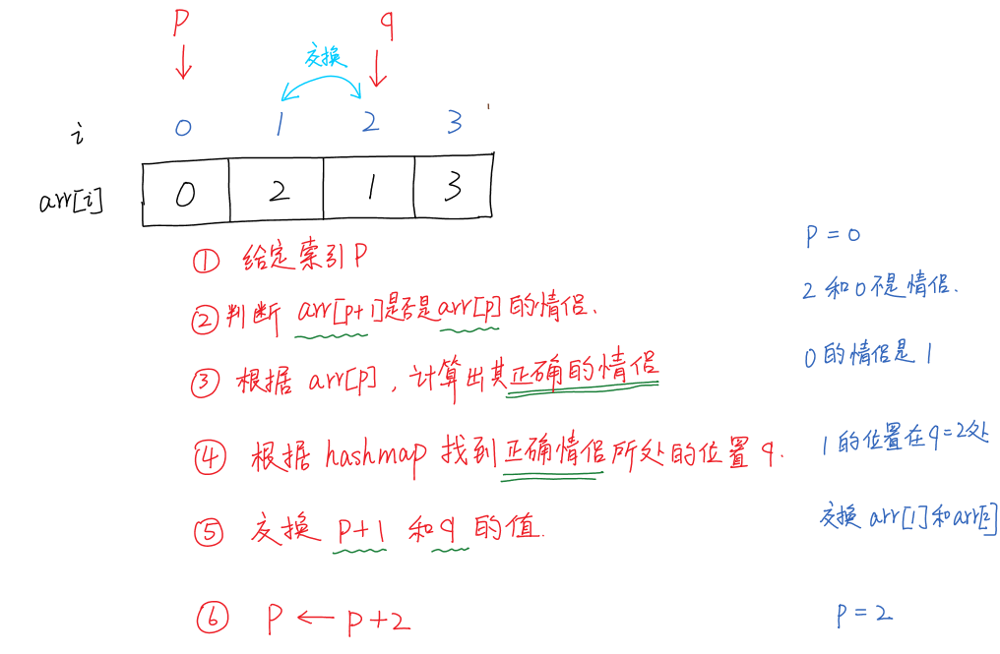
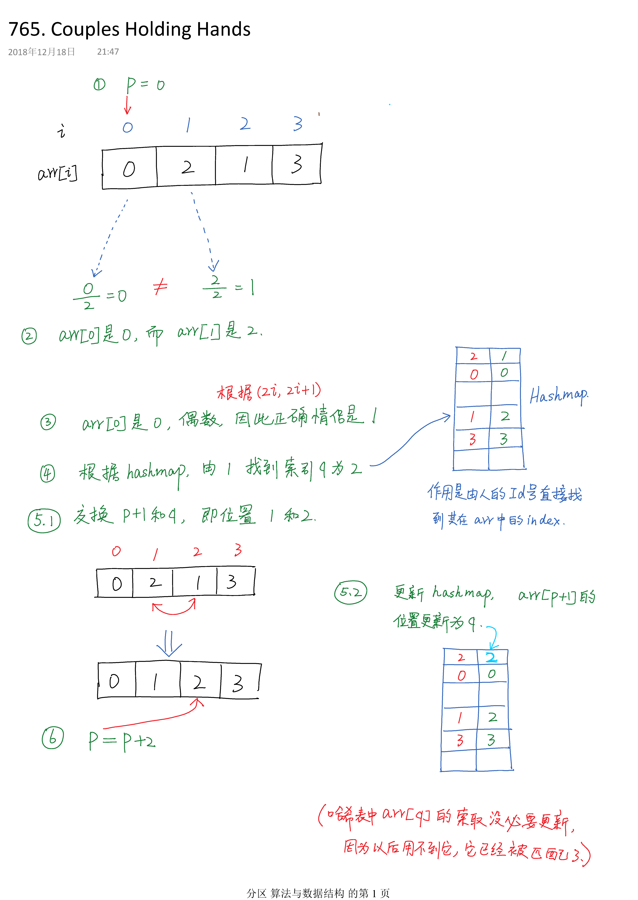

#  765. Couples Holding Hands


## [题目](https://leetcode.com/problems/couples-holding-hands)

N couples sit in `2N` seats arranged in a row and want to hold hands. We want to know the minimum number of swaps so that every couple is sitting side by side. A *swap* consists of choosing **any** two people, then they stand up and switch seats.

The people and seats are represented by an integer from `0` to `2N-1`, the couples are numbered in order, the first couple being `(0, 1)`, the second couple being `(2, 3)`, and so on with the last couple being `(2N-2, 2N-1)`.

The couples' initial seating is given by `row[i]` being the value of the person who is initially sitting in the i-th seat.

**Example 1:**

```
Input: row = [0, 2, 1, 3]
Output: 1
Explanation: We only need to swap the second (row[1]) and third (row[2]) person.
```


**Example 2:**

```
Input: row = [3, 2, 0, 1]
Output: 0
Explanation: All couples are already seated side by side.
```


**Note:**

1. `len(row)` is even and in the range of `[4, 60]`.
2. `row` is guaranteed to be a permutation of `0...len(row)-1`.

## 思路

人的索引是$0,\cdots, (2N-1)$，其中索引号为$(2i,  2i+1)$，$i=0,\cdots,(N-1)$被认为是一对情侣。

> 题目中`(0，1)，(2,3),(2N-2,2N-1)`都可以用上述公式表示，

现在给定$2N$个人的随机排列，问需要换座位多少次，才能保证序列由相邻的情侣组成。




采用从前到后的顺序，索引	`p`从0开始，每进行一次检查，就**增加2**，即跳过一个人。

1. 初始化`p=0`

2. 判断`arr[p]`和`arr[p+1]`是否是情侣关系。判断的标准是满足`(2i，2i+1)`,即判断`arr[p]/2 ==arr[p+1]/2`,这里用到整数相除，只保留整数部分。若相等，则进行下一组检验，`p=p+2`.若不相等，转到步骤2.

3. 根据`arr[p]`,计算出ta的情侣应该是谁，计算的依据的检查`arr[p]`的奇偶性。若是奇数，正确情侣就是`arr[p]-1`;若是偶数就应该是`arr[p]+1`

4. 我们之前设置了一个hashmap，可以根据人的ID找到其所处的arr的索引，就找到`q`

5. **注意**：交换的目的是为了与`arr[p]`配对，因此，交换的位置是`p+1`和`q`

6. $p \leftarrow p+2$


## 算法实现

```java
 public int minSwapsCouples(int[] row) {

        int count=0;
     
        HashMap<Integer,Integer> idxMap = new HashMap<>();//存储由id到row中的索引

        for(int i=0;i< row.length;i++){
            idxMap.put(row[i],  i);//由ID// 找到row的位置
        }

        for(int k=0;k<row.length;k = k+2){  //每次跳两格


            if (row[k]/2 != row[k+1]/2){  //相邻位置不匹配

                int manId = row[k];//当前

                int womanId =  (manId % 2 == 1) ? manId-1 : manId+1;

                int womanPos = idxMap.get(womanId);//得到位置

                idxMap.replace(row[k+1],womanPos); //这一步很关键

                //交换值
                int temp = row[k+1];
                row[k+1] = row[womanPos];
                row[womanPos] = temp;

                count++;
            }

        }
        return count;
```

该程序打败了72.6%的提交。

## 图解




## 总结

需要掌握什么情况下需要交换，交换的位置是哪两个，hashmap的应用也有利于程序效率.

另外，还可以用**并查集**对问题进行求解，效率更高。